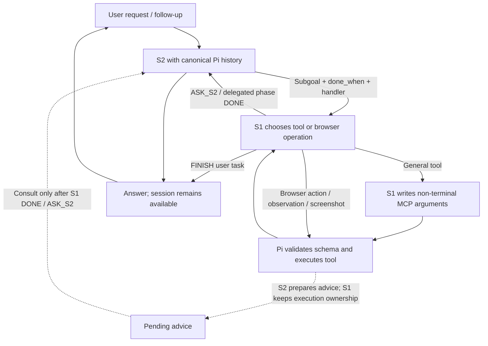

# Taiji Pi session trial

This is a local Pi **1.0.0** SDK session with S2-owned task lifecycle and S1 browser/general tool execution
providers. It uses a private state directory; the globally installed Pi is unchanged.
There are no channels, resident service, default step limit, or independent verifier.

```sh
cd pi_agent
npm ci
npm start
```

The TUI accepts subsequent conversation in the same session. Headless examples:

```sh
npm start -- --new --prompt 'Open https://books.toscrape.com/ and find the first three Travel books and their prices.'
npm start -- --prompt 'Now open the first book and report its availability.'
npm start -- --session /absolute/path/to/session.jsonl --prompt 'Continue from this session.'
```

Default local S1 endpoint: `http://127.0.0.1:8010`. Default S2 proxy:
`http://127.0.0.1:10100/v1`, model `opencode-go/deepseek-v4-flash-vision-exp`.
The measured smoke tests used `TAIJI_S2_MODEL=opencode-go/muse-spark-1.3-contributor`.
A private `STATE_DIR/s1.env` can set `TAIJI_S1_URL` and `TAIJI_S1_API_KEY`
for a local GPU host; explicit environment values take precedence. Only these two
keys are loaded. Keep the file private and out of Git. The AORUS setup stores this
in `pi_agent/.state/s1.env`, so a new default-state CLI uses its LAN endpoint.

Override credentials/endpoints with `TAIJI_S1_URL`, `TAIJI_S1_API_KEY`,
`TAIJI_S2_BASE_URL`, `TAIJI_S2_API_KEY`, and `TAIJI_S2_MODEL`.
`TAIJI_PI_ENABLE_S1=0` runs a normal S2 Pi session. `--no-mcp` skips all MCP servers; native tools and `run_command` remain available.
Python dependencies come from the existing `agent_runtime/.venv`; initialize with
`uv sync --project ../agent_runtime` if needed.
Pilot's extension/daemon must already be available; GPU services are not restarted.

## Decision and execution flow



Terminal commands, scripts and code edits belong entirely to S2. This includes
`run_command`, `bash`, `write`, `edit` and code execution tools. S2 decides whether
execution is needed and writes the commands itself. The S1 catalog excludes these
tools; provider and tool-dispatch guards also reject S1 terminal calls. S2's tool
catalog stays fixed across handoffs. S1 retains browser execution and non-terminal
MCP selection. Simple tasks can finish through its own FINISH choice.

S2 owns intake and the task lifecycle. It delegates a phase with
`taiji_delegate(subgoal, done_when, handler)`; the visible phase condition is required.
After S1 makes a decision and its tool returns, S2 can reason concurrently using
that native history snapshot. There is one pending S2 request per phase, not one
per action. Its response stays pending and never changes execution ownership. Only S1
phase DONE or help hands control back to S2. A ready suggestion is then attached
to the inline handoff as explicitly outdated advice; a fresh S2 request decides
from the latest state and history. Suggested tool calls are never replayed or
executed automatically. Unfinished background work is cancelled at handoff. New phases, new user input and cancellation discard old pending
responses. No separate verifier, action-count cap or site-specific termination
rule is used. S2 must inspect fresh state before a state-sensitive mutation.
Background model attempts, including cancelled ones, are audited separately.
`handler="tools"` enables general tool selection and argument generation;
`handler="browser"` plus an observed `tab_id` uses the existing browser policy.
A delegated phase DONE returns to S2 to continue planning or answer. Neither path
has an independent completion verifier. Parameterless tools skip argument writing;
other arguments are generated through S1's existing field writer, then validated
against the selected native/MCP JSON schema. Invalid arguments ask S2 and are not
executed. Tool errors and output omissions are visible to the model for recovery.

The browser contract rejects S2's direct `browser.act` unless it chose
`executor="s2"` with a reason. Terminal ownership is the reverse: S2 executes
it directly; S1 hands it off. S1 chooses browser screenshots, completion and help.
Neither execution ownership nor schema validation guarantees correct completion.

Example in the TUI: `Use run_command to count the TypeScript source files directly
inside pi_agent/src and report the observed count.` No prewritten command is
needed. Restart the Pi CLI to load this implementation; existing sessions can be
resumed with `--session`.

S1 → S2 handoff now appends a structured packet: `kind`, reason, phase and
completion condition, tab/URL, recent operations and final page state. `model_help` and `phase_done` are model decisions;
`input_limit` is a harness guard and `tool_error` is an execution/protocol failure.
S2 continues from canonical Pi history rather than a replacement summary. Full
action tables stay inline in session metadata for S1; S2 receives page text and
control values directly and may request an image. No observation document/file is
created or read by this path. The fixed handoff schema is installed once
per runtime, not swapped on each transfer.

The Pi browser/tool adapters no longer reject observations at 20,000 characters.
The vLLM decision compiler checks actual tokenizer output against the deployed
context budget and rejects overflow without dropping page text or elements.
`/health` reports `max_model_len`, so the serving limit is observable.

## Context and cache

Pi owns canonical history, session branches, user messages, tool calls/results,
images, and native compaction. S1 receives a separate projection: active request,
prior requests/answer as context, concrete delegated subgoal, current page and
elements, recent actions, and an image only after the model requests one. The general
tool projection includes the active request, earlier requests/answers, project
instructions, delegated phase, session cwd and all tool results from the current task. Results
over 5,000 characters retain an explicit omission count and full-output path when
available; the model can read more. Pi retains complete canonical history.
An observation invalidates the previous screenshot. Completed earlier requests
are not presented as new work. Oversized projections hand off to S2 rather than
silently removing user constraints or target candidates. Token overflow is checked by the vLLM decision compiler, not a character estimate.
Each new user turn observes the current page before acting on historical refs.
The complete task operation chain includes every action and READ, page/URL/field
changes and repeated unchanged attempts. There is no last-ten or last-six history
window, including across S2 replanning. S1 decision heads and field writing both
receive this complete chain; `recent_actions` is a legacy field name, not a cap.
Replanning retains failed-action evidence rather than clearing it at delegation.
S1 phase dispatch now ranks LOCAL, DONE and ASK_S2 in the same request.
DONE refers to the delegated phase condition, not composing the parent task answer.
No completion probability threshold or automatic override is added. Pilot MCP
error flags are propagated instead of discarded as successful observations.
S1 can choose READ, LOOK or ASK_S2. These are model choices; no repeated-action
count forcibly overrides the policy. Current live tests still repeat failed clicks.
The operation/dispatch heads are ranked first; only a chosen target head is read
afterward. Target criteria reference indices in the complete `state.elements`
view instead of repeating label/link/value metadata. No target candidates are
dropped by this change. WAIT/READ/LOOK can use one model request; clicking usually
needs two, with an optional tie-break and field-text generation as applicable.
Large selected projections can still exceed S1's budget and require fallback.
The S1 checkpoint and current AORUS service support 262,144 tokens. The launch
script uses `--max-len 262144`, `--gpu-memory-utilization 0.92`,
`--quantization fp8_per_tensor`, and `--mm-max-pixels 409600`. Online FP8
quantization applies to text linear weights; `*visual*` and `*lm_head*` are
excluded, and the separately loaded Taiji decision head stays FP32. CPU weight
offload is disabled. FlashAttention 2, the V2 runner, BF16 KV cache and one
screenshot per request remain enabled. `/health` exposes the serving length,
quantization scheme and CPU offload setting.
The same saved Maps observation measured 7.91s with BF16/0.75GiB CPU offload,
3.22s on the first FP8 request and 0.74s when repeated with prefix-cache hits.
These are observation replay timings, not a complete task or accuracy evaluation.
New CLI processes load the adapter changes; an already-open CLI retains old code.

The session context capacity is discovered from the proxy's `/models` metadata.
Both tested S2 models advertise 1,048,576 tokens. The earlier trial incorrectly
registered 64,000 tokens, causing native compaction around 47,616 tokens with
Pi's reserve. This is fixed for new runtimes; the S1 server still receives only
its bounded projection. Explicit overrides are `TAIJI_S2_CONTEXT_WINDOW`,
`TAIJI_S2_MAX_TOKENS` and `TAIJI_S2_REASONING_EFFORT`.

The S2 system prompt, initial tool schemas, and skill catalog remain stable across
model handoffs. The configured MCP tools are direct and fixed at session startup;
schemas are not ranked/replaced every step. Relevant skill text can be read with
Pi's native read tool. Other MCP tools can be discovered through native
`tool_search`; genuine capability additions and native compaction can change the
prefix. This trial does not alter Pi's cache-warming setting or guarantee backend
cache residency. Native compaction remains enabled for long sessions.

State defaults to `pi_agent/.state/`, configurable with `TAIJI_PI_STATE_DIR`.
It includes private MCP configuration, session files and `audit.jsonl`.
`s2_prefix` compares serialized request system/tools/message prefixes. Per-session
hash fingerprints survive process restart without retaining raw request text.
`s2_raw_usage` and `s2_usage` record provider-reported cached tokens. Stable prefixes
are necessary evidence of cache-compatible input; they do not prove a cache hit.
Prices in SDK cost metadata are zero placeholders, **not a claim of free usage**.
`s1_request` records general selection/writing attempts and elapsed time. CLI
`s1_model_requests` counts attempts, including failed requests, not just successful
responses. `tool_execution_result` attributes general tool outcomes to the executor.
`tool_dispatch` attributes tool requests to the executor; `browser_action_result`
records errors and observable page changes. A page change is not proof of task
progress. `s1_decision.model_calls` records actual head/tie/text requests separately
from synthetic provider responses. The headless summary includes those requests,
local action counts and explicit S2 fallback attempts.

The Pi adapter sends compact browser text plus the full structured state inline.
The insertion hook preserves that state in session metadata for S1. Tab inventory
uses columns/rows to remove repeated metadata. Browser observation files are not
used for handoff. Malformed/missing output transfers to
S2 and cannot cause repeated observation or a mutation from an older page.
The Pi-only Pilot stdio wrapper closes its client when the parent session closes.
The agent chooses tabs through `list_tabs`, `navigate(tab_id, url)`, `new_tab(url)`
and `close_tab(tab_id)`. Observation, action and native screenshot tools accept
an optional `tab_id`; explicitly choosing one selects it for following S1 actions.
`navigate` never creates tabs. `new_tab` creates one only when the agent calls it.
The legacy `open` and `close` tools are hidden by the example Pi configuration.
The selected tab is persisted in `browser-tabs/<session-id>.json` and restored
across MCP restarts. Navigation errors never trigger automatic tab creation.
Unknown creation outcomes can be inspected with `list_tabs` and reconciled by
explicitly selecting an observed tab; another creation remains blocked meanwhile.
For standalone adapter use, set `TAIJI_PILOT_TAB_STATE` to a private session file.
Before its first navigation, an unbound observation reads Pilot's current page.
Restart an already running Pi process to load these code changes; historical
sessions from before this fix have no saved ownership to restore.

## Validation and limits

Run `npm run check` and `npm test`. Tests cover native Pi execution/history,
handoff/delegation, cancellation, observation validity, optional images, active
follow-up context, prefix persistence, and cached-token reporting.

Live results and evidence are documented in
`docs/handoffs/2026-10-02-pi-session.md` and
`docs/handoffs/2026-10-02-s1-policy-trial.md`. This is a session integration trial,
not a demonstration that S1 reliably solves Google Flights or outperforms S2.
The browser adapter still lacks viewport/geometry metadata and numbered screenshot
overlays. SELECT is unsupported in this trial and transfers to S2. It cannot yet
provide S1's own tab-choice classifier; S2 handles the general tab tools. Native
MCP full-output paths may be temporary. Original observations are saved
outside the model transcript; inserted summaries retain actions and semantic
metadata. Image history still costs context, and native compaction can invalidate caches.
The follow-up execution-contract test and live results are in
`docs/handoffs/2026-10-02-pi-execution-phases.md`: S1 now executes a bound phase,
but the flight rerun still needed explicit S2 fallback and did not click Search.

The general writer currently emits at most 64 tokens. S1 is told this limit and
can ask S2 for longer complete answers; output truncation is explicit in its
projection. Real AORUS tests verify command/MCP dispatch and image decisions,
but also expose incorrect command scope and inefficient recovery. See
[the AORUS deployment and trials](../docs/handoffs/2026-10-02-aorus-vllm.md).
